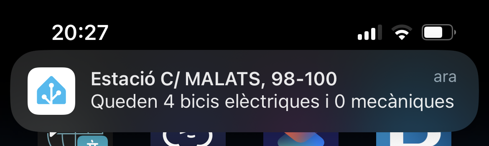

# Bicing per al Home Assistant

## Què és?
Una integració per a monitoritzar l'estat del servei del Bicing al Home Assistant. El motiu que m'ha portat a desenvolupar-lo és per, a banda d'aprendre com funcionen les integracions del Home Assistant, saber quantes bicicletes elèctriques hi ha abans de sortir per anar a treballar.

## Instal·lació

### Usant _My Home Assistant_

## Configuració
Et farà falta generar un token del servei de dades obertes de l'Ajuntament de Barcelona. Pots obtenir-ne un de forma completament gratuïta des d'[aquest enllaç](https://opendata-ajuntament.barcelona.cat/ca/tokens)

Un cop tinguis el token, caldrà que afegeixis una entrada des de la pantalla d'integracions del Home Assistant. A continuació, enganxa el token obtingut i selecciona les estacions del Bicing que vulguis monitoritzar. Més tard podràs afegir-ne més usant el botó de reconfigurar.

Es crearà una entitat per a cadascuna de les estacions. El valor de l'entitat serà el nombre total de bicicletes disponibles a l'estació i, els atributs seran els següents:
-  Bicicletes elèctriques disponibles
-  Bicicletes mecàniques disponibles
-  Ancoratges disponibles

Amb aquestes dades, podràs crear automatitzacions per a que et notifiqui si queden bicicletes o no, ancoratges, etc.

## Origen de les dades
[Informació de les estacions del Bicing](https://opendata-ajuntament.barcelona.cat/data/ca/dataset/informacio-estacions-bicing)
[Estat de les estacions del Bicing](https://opendata-ajuntament.barcelona.cat/data/ca/dataset/estat-estacions-bicing)

